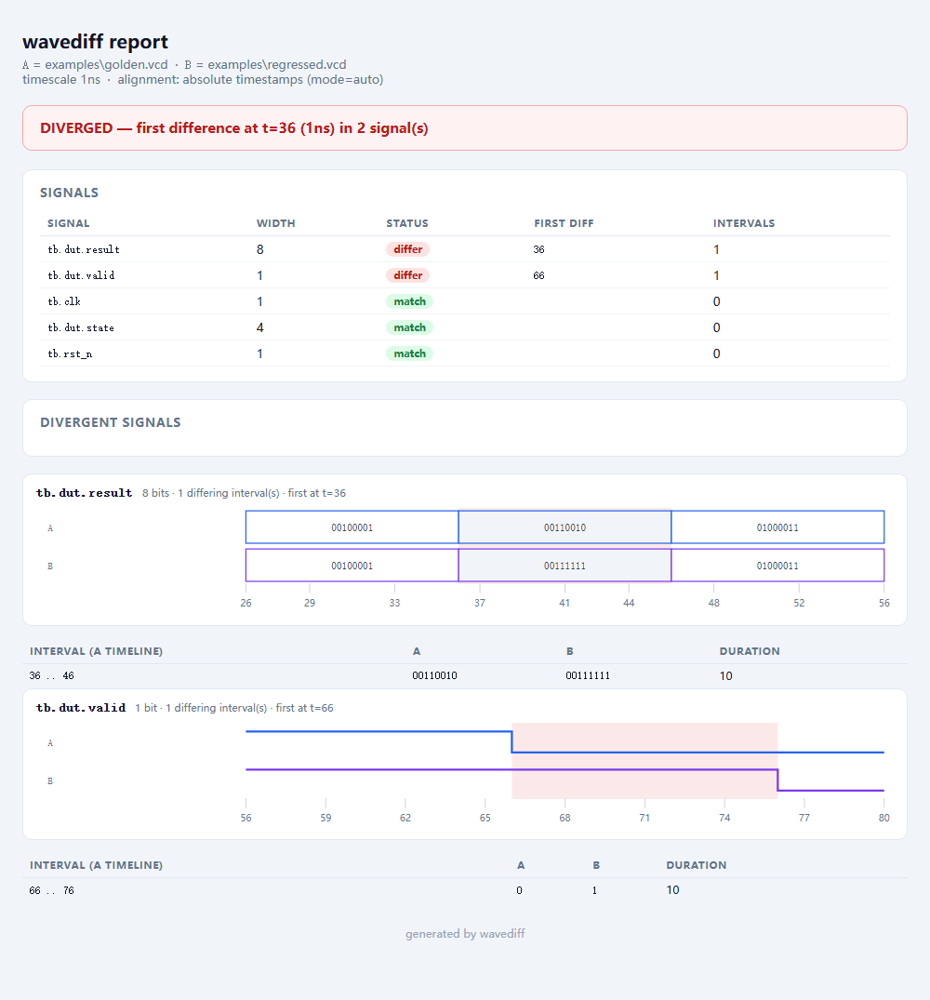

<div align="center">

# wavediff

**Find the first moment two simulation waveforms disagree.**

Stop eyeballing two GTKWave windows. Point `wavediff` at your golden dump and
your new dump, and get told *the exact time and the exact signal* where they
first diverge — as a CI exit code and as a report you can paste into a PR.

[](https://github.com/Sonnet-dawn/wavediff/actions/workflows/ci.yml)
[](https://www.python.org/)
[](LICENSE)
[](pyproject.toml)

*English · [简体中文](README.zh-CN.md)*

</div>

---

## The problem

You changed the RTL. You re-ran the test. It still "passes". But you need to
know **what else moved** — and the only tools that answer that are Verdi and
SimVision, which cost more than your laptop and only read FSDB.

So the waveform equivalent of `git diff` has been missing, and the workaround
is a human scrolling two synchronized waveform windows looking for a step that
happens at a different place. That is:

- **slow** — minutes per regression, per signal
- **unreliable** — the interesting change is usually off-screen
- **invisible to CI** — no exit code, no artefact, nothing to review

`wavediff` is the missing command.

## What it does

```console
$ wavediff examples/golden.vcd examples/regressed.vcd --html diff.html

A: examples/golden.vcd
B: examples/regressed.vcd
alignment: absolute timestamps (mode=auto)

DIVERGED  first difference at t=36 (1ns); 2 differ, 3 match, 0 only in A, 0 only in B

  t=36         tb.dut.result                            A=00110010     B=00111111     (1 interval(s))
  t=66         tb.dut.valid                             A=0            B=1            (1 interval(s))

HTML report written to diff.html
```

Two regressions, both located, in one command:

1. **`t=36`** — the first cycle where anything differs. Not "somewhere in this
   50 MB dump".
2. **`tb.dut.result` and `tb.dut.valid`** — hierarchical names, ready to paste
   into a waveform viewer or a bug report. `tb.dut.state`, `tb.clk` and
   `tb.rst_n` are untouched, which is stated rather than left to inference.
3. **Intervals, not just points** — `result` is wrong from `t=36` to `t=46`,
   `valid` is wrong from `t=66` to `t=76`. A one-cycle glitch and a stuck
   control signal are different bugs, and the report distinguishes them.

The HTML report draws both versions of each divergent signal with the
disagreeing intervals shaded:



That file is `docs/demo.html` — a single self-contained file with inline SVG,
no scripts and no network requests, so it works from an email attachment or a
shared drive. Reproduce it in ten seconds:

```bash
git clone https://github.com/Sonnet-dawn/wavediff && cd wavediff
PYTHONPATH=src python -m wavediff examples/golden.vcd examples/regressed.vcd --html diff.html
```

```console
$ wavediff golden.vcd regress.vcd        # human output, exit 1 if diverged
$ wavediff golden.vcd regress.vcd -q     # silent, CI mode
$ wavediff a.vcd b.vcd --json out.json   # machine-readable
```

## Install

```bash
pip install git+https://github.com/Sonnet-dawn/wavediff
```

<!-- FLIP ME: once the PyPI release is live, replace the line above with
     `pip install wavediff` and delete this comment. See docs/PUBLISHING.md. -->

No dependencies. Pure Python, stdlib only. It reads VCD; nothing to compile and
nothing to license. Installing this way pulls in nothing but `wavediff` itself.

## The hard part: timelines are not comparable

This is the reason `wavediff` exists as more than a 50-line script.

Two dumps of "the same" testbench have **no guaranteed common time origin**.
Add a pipeline stage and *every* downstream transition in B happens one cycle
later than in A. A naive diff then reports hundreds of differences when there
was exactly one real functional change — the tool becomes noise and you stop
using it.

So alignment is explicit, and it is always printed in the report so you can
audit it:

| `--align` | What it does | When to use it |
|---|---|---|
| `none` | Absolute timestamps, no adjustment. | A small RTL edit, same time origin. |
| `auto` *(default)* | Infers an offset by **majority vote** across all shared signals. | You do not know whether the timelines line up. |
| `shift --shift N` | Applies a constant offset `N` to B. | You know the latency delta. |
| `reference --reference SIG` | Aligns B so a named signal's first transition matches A's. | One clock or reset is your ground truth. |

`auto` is deliberately conservative — it will **not** shift a timeline on the
strength of one signal, and on a tie it stays put, because shifting a timeline
is a destructive act:

```console
$ wavediff golden.vcd shifted.vcd
alignment: B shifted by -10 time units (mode=auto, 4/4 shared signals agree on offset -10)
IDENTICAL  (4 signals compared, no differences)
```

> **Why a vote and not one reference signal?** See
> [`docs/design.md`](docs/design.md) for the alignment model, why `t=0` state is
> excluded from the vote, and worked examples.

## Use it in CI

Exit codes are the contract:

| Code | Meaning |
|---|---|
| `0` | Identical under the chosen alignment. |
| `1` | Diverged — at least one signal differs, or exists in only one file. |
| `2` | The comparison could not run (bad file, bad option). |

```yaml
# .github/workflows/regression.yml
- name: Compare against the golden waveform
  run: |
    wavediff golden/${{ matrix.test }}.vcd artifacts/${{ matrix.test }}.vcd \
      --align auto --html diff.html --json diff.json
- uses: actions/upload-artifact@v4
  if: failure()
  with:
    name: waveform-diff
    path: diff.html
```

The uploaded `diff.html` is the entire bug report: it is a single
self-contained file with inline SVG, no scripts and no network requests, so it
works from an email attachment or a shared drive.

## Why not just use ...?

| Tool | Verdict |
|---|---|
| **Verdi / SimVision** | Can diff FSDB, and costs a licence per seat. `wavediff` is free, reads VCD, and runs headless in CI. |
| **GTKWave** | Excellent viewer, but comparing two files is still [an open feature request](https://github.com/gtkwave/gtkwave/issues/315). `wavediff` produces a report instead of asking you to look at one. |
| **`diff a.vcd b.vcd`** | Compares the *text* of the dumps. Variable id codes, zero-padding and timestamp formatting all differ between runs, so the noise buries the answer. |
| **`vcddiff`** | A decade-old script with no alignment model and no report. |

## Scope and limits

Being explicit about this is more useful than overselling it:

- **Reads VCD only.** FST and GHW support is [on the roadmap](docs/roadmap.md); FSDB is proprietary.
- **Python parser today.** The parser is a single forward pass and is fast for
  typical testbench dumps, but VCD files in the tens of GB will want the native
  backend described in the roadmap. The parser interface is already factored so
  that a compiled core can drop in behind it.
- **Diffing is exact, not sampled.** It compares transition streams, so it is
  correct at any timescale resolution and costs `O(transitions)` rather than
  `O(duration / step)`.

## Library use

```python
import wavediff

a = wavediff.read_vcd("golden.vcd")
b = wavediff.read_vcd("regress.vcd", signals=[r"^tb\.dut\."], max_time=10_000)

result = wavediff.diff(a, b, mode="auto")

if not result.identical:
    print(f"first difference at t={result.first_divergence}")
    for sig in result.differing:
        for run in sig.runs:
            print(f"  {sig.name}: {run.describe_time()}  {run.value_a} -> {run.value_b}")
```

## Development

No dependencies and no framework to learn — the suite is stdlib `unittest`:

```bash
git clone https://github.com/Sonnet-dawn/wavediff
cd wavediff
PYTHONPATH=src python -m unittest discover -s tests -t tests -v
```

Contributions are welcome. The most useful things you can send are **VCD files
that break the parser** and **pairs of waveforms where `auto` alignment picks
the wrong offset** — both are added to `tests/fixtures/` as regression cases.

## License

[Apache-2.0](LICENSE).
